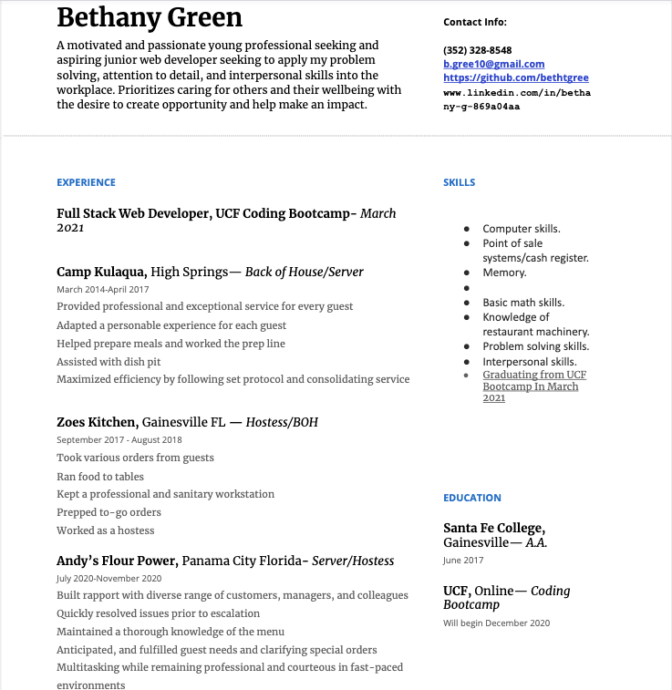

This is an updated portfolio
I used the Materialize framework. 
I also uploaded some extra repo's to the portfolio page along with my first project.

**Screenshots below**

*deployed link*

 https://bethtgreen.github.io/BethsPortfolio/
